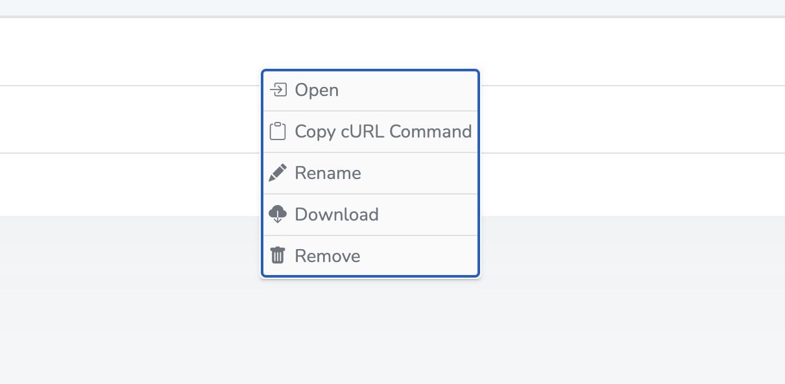
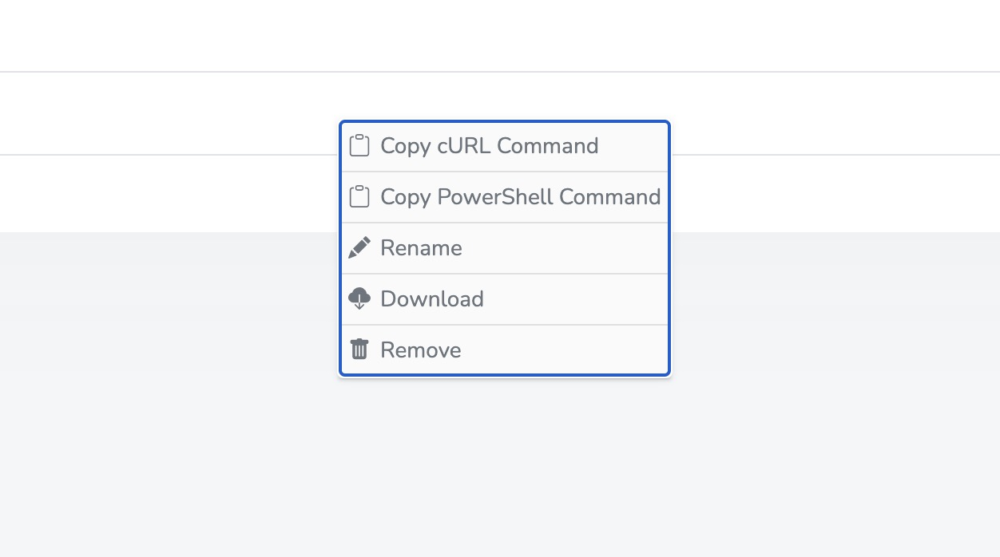

# Some R2 Explorer

This project is based [R2-Explorer](https://github.com/G4brym/R2-Explorer) by [Gabriel Massadas](http://massadas.com/). To see all features go to his [README.md](https://github.com/G4brym/R2-Explorer/blob/main/README.md) page.

This version let user copy file as cURL commannd and powershell if the file is ending with .ps1.





I assume that you are using the project behind cloudflare zerotrust. To make it works you will 2 need two things:

- Create a service auth token in the zerotrust interface
- before doing the wrangler publish, you need to create 2 secrets with wrangler.

```bash
npx install @service-yack/some-r2-explorer@<latestTag> my-some-r2-explorer
# ex: npx install @service-yack/some-r2-explorer@1.0.2 my-some-r2-explorer
cd my-some-r2-explorer

# modify config to fit your need in those 2 files
nano wrangler.toml
nano src/index.js

# put secret in worker
wrangler secret put CF_ID
# you will be prompted to enter your secret
wrangler secret put CF_SECRET
# you will be prompted to enter your secret

# finish the installation
npm i
wrangler publish
```

Note: this feature will work is readonly mode is set to false and curlFeature to true.

```js
// example of src/index.js

import { R2Explorer } from '@service-yack/some-r2-explorer';

const explorer = R2Explorer({ readonly: false, curlFeature: true })

export default {
  async fetch(request, env, context) {
    return explorer(request, env, context)
  }
};
```

**Credits**

- [Gabriel Massadas](https://github.com/G4brym)
- [somecanadian](https://github.com/som3canadian)
